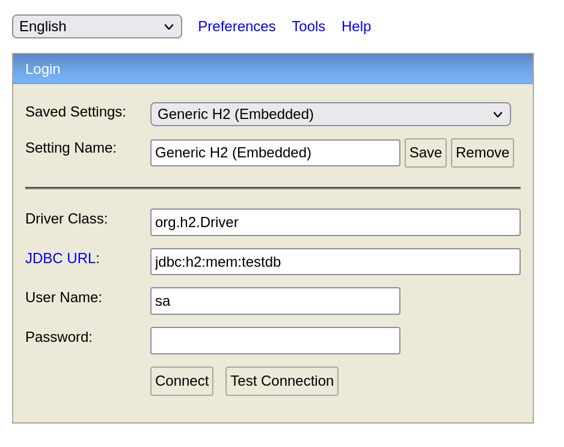

# kjøring

## nettleser
<localhost:8080> for å se frontend, etter at man ser at loggeren skriver at alle filer er laget så burde den være klar (tar under 30-ish sekunder fra kjøring)

## selve applikasjonen

`./mvnw spring-boot:run` i terminal burde funke om man har java 20 instalert, om ikke så bare åpne programmet i intellij, konfigurer med open-jdk-20, og trykk play på main funksjonen i `PayexApplication.java`

man kommer til å få litt errors ved parsing av json, men dette er handlet og er bare å vente på den siste linjen alla

```java
2023-06-05T14:58:10.753+02:00  INFO 180811 --- [  restartedMain] com.tvapi.payex.Repo                     : Report is written
```

for å så gå inn i nettleseren på adressen vist over

## db konsoll

gå hit: <localhost:8080/secret-h2-console/>

pass på at feltene ser ut som dette:



# rapporter

disse kommer ut i fil eller kan sees og lastes net i nettleser, slettes og skrives på nutt ved kjøring, tenkte å la bruker velge rapport fra commandline args eller ved curl requests men ble ikke nok tid så forble ved ui eller i fil systemet

## next week
skjønte ikke helt hva som spurtes om her, mange av showene er jo ferdig kjørt, og vil ikke ha noen info om neste uke

## reccomended

skjønte ikke helt denne heller, hva menes?

## Top 10 - Skal liste serier sortert på rating

denne blir skrevet til fil og kan finnes ved frontend

## Top Network
Gjorde i kode istedenfor i database, skippet å lage network struktur / implementere den ordentlig

## Summary

denne blir også skrevet til fil, og kan også finnes ved frontend

# Om Liten tid og valg

Hadde liten tid så kunne ikke gjøre alt til standarden jeg ønsker

- ui
- ikke ORM
- valg av database

## Om Samle struktur
ideally så ville jeg ha hatt at shows skulle ha en liste med episoder, men fikk problemer med beanpropertyrowmapper så bestemte meg for å ikke ha det sånn, dog med ORM så ville jeg jo hatt det sånn sånn at koblingen ble lik mellom objekt modellen og tabell strukturen i databasen.

Syntes det er litt dårlig at jeg returnerer et samleobjekt men siden det var limit på API queries og man får alt i samme query så tenkte jeg at det var best å ta alt i en

## Plain UI

virket ikke som at det var fokus på frontend så bare gjorde noe enkelt

## Om ikke ORM
lærte spring boot på en litt dated måte, hadde ikke nok tid til å sette meg inn i den nyere ORM orienterte måten, så ble sånn her denne gangen.

Har jobbet med ORM i .NET så er kjent med konseptet

## Hvorfor H2

Var det vi brukte når jeg var lærer assistent i faget, syntes at postgres er kulere egentlig, men var H2 vi brukte for å raskt bare få en database in memory og også ha en nett consoll, så gikk for det med tanke på tid.

## Om 429 error handling
det skjedde ikke for meg at den error en kom, vet ikke om jeg handlet den feil men fikk hentet alt uten at erroren intraff, handlet for det uansett men fikk ikke testet om den var handlet riktig.